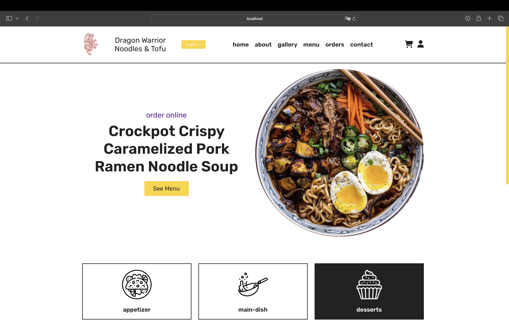
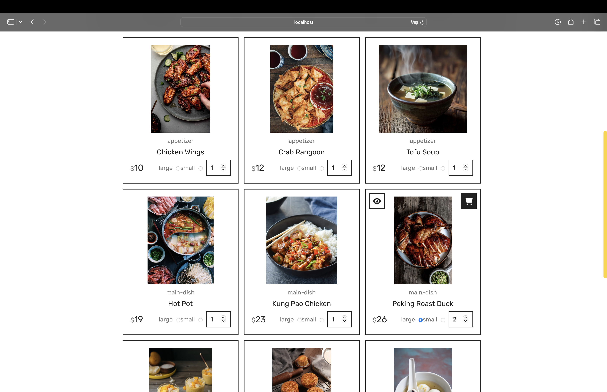

# 🍜 Chinese Restaurant Website

This project is a website for a Chinese restaurant, developed using **Vue.js**, **JavaScript**, **HTML**, and **CSS**. The site supports multiple languages and allows users to browse the menu, order food, and log in to their accounts.

## 🎯 Features

- **Menu Browsing**: View dishes with categories, ingredients, and options for size and quantity.
- **Food Ordering**: Allows users to add items to the cart and place orders.
- **Multilingual Support**: The user interface can switch between multiple languages.
- **User Accounts**: Log in and register functionality for users.

## 🛠️ Installation

To run the project, make sure you have **Node.js** and **npm** installed. Then, follow these steps:

1. **Download or Clone the Project** from GitHub:

   ```bash
   git clone PROJECT_URL

2. **Navigate to the Application Folder in Project Terminal:**

   ```bash
   cd app

3. **Install npm:**

   ```bash
   npm install

4. **Start the Local Server using npm:**

   ```bash
   npm run serve
   
5. **Once the server is running, open the provided URL in your preferred web browser (usually http://localhost:8080).**


 ## 📚 Technologies

- **Vue.js** for frontend development and dynamic component rendering.
- **JavaScript** for application logic.
- **HTML & CSS** for page structure and styling.

 ## 📂 Project Structure

- **src/** Contains all main components, pages, and project configurations.
- **public/** Holds static files and the base index.html file.
- **src/assets/** Contains images and multimedia files used in the project.

## 🖼️ Screenshot




## 🚀 Authors

This project was created by Davud Nušević and Vuk Lužanin.
